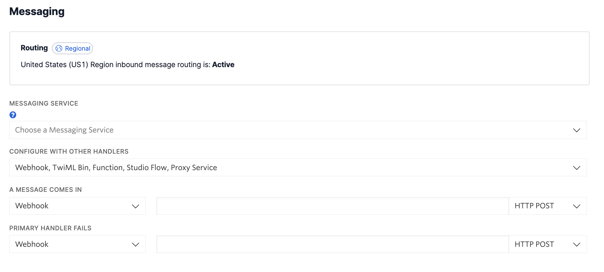

<h1 align="center">Twilio Conversations API Demo</h1>

 

This is a lightweight application based on [Twilio Conversations](https://www.twilio.com/docs/conversations).

It is a refactor of the code found in the [Conversations Quickstart](https://www.twilio.com/docs/conversations/quickstart#sign-into-codesandbox-and-fork-our-demo-application).

# Configuring and getting started

The following instructions assume you already have a [Twilio Number](https://www.twilio.com/docs/usage/tutorials/how-to-use-your-free-trial-account#get-your-first-twilio-phone-number) and this number is a [WhatsApp Sender](https://www.twilio.com/docs/whatsapp/self-sign-up#1-create-a-whatsapp-sender). If not, please refer to those links and setup those accordingly.

### Twilio Console

1. Make sure your number has nothing configured under Phone Numbers > Active Numbers (click on your number to see the following screen):

2. Under the Messaging Product, create a new service: Services > Create Messaging Service.

3. Inside your service under Sender Pool, click on Add Senders and add your WhatsApp number.

4. Under the Conversations Product, create a new service: Services > Create a new service.

### Backend

You will need a backend service for this app to work. This app uses Twilio Serverless functions. [Check it out our Twilio Serverless Toolkit](https://www.twilio.com/docs/labs/serverless-toolkit/getting-started). You are also welcome to use the code here on your own service, and if so, you can skip this backend session.

1. In the root of the `backend` folder, make a `.env` according to the `.env.example`.

2. Add all the values accordingly. The `SERVICE_SID` should be the Conversation service you created in the Console (step 4 of the Twilio Console session above).

3. Deploy it by running `twilio serverless:deploy`

### Frontend

1. In the root of the `frontend` folder, make a `.env` according to the `.env.example`.

2. Add the 2 URLs of the functions you created in the backend session above accordingly.
